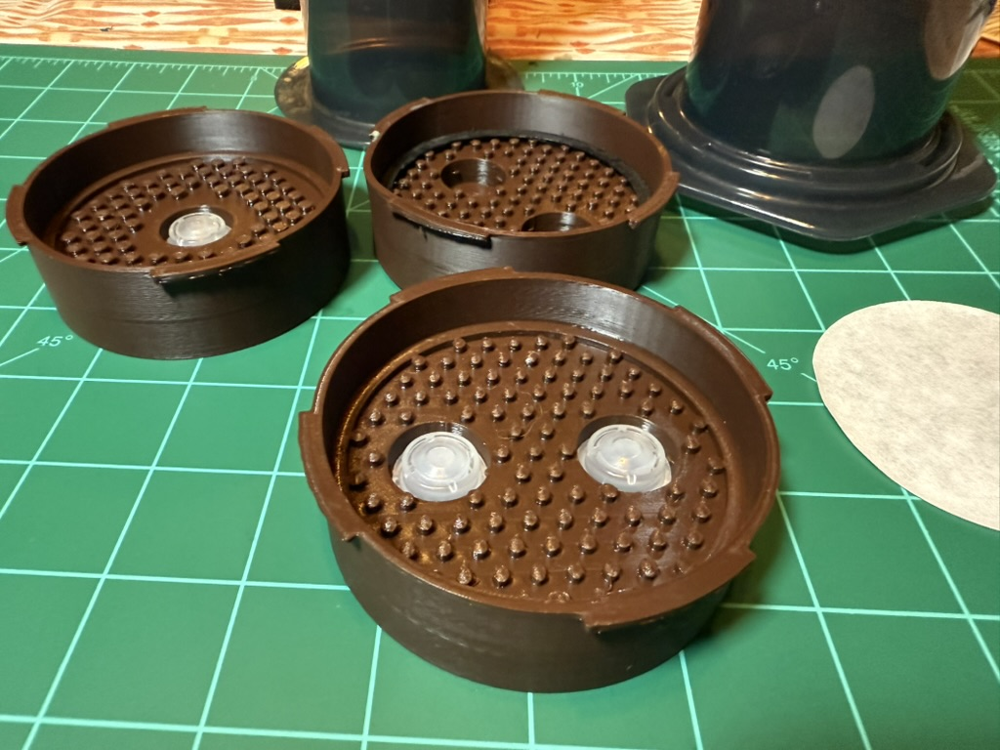

# Welcome to JMC

Welcome to **Jason Makes Coffee** — a journey into the intersection of 3D printing, coffee brewing, and open-source hardware design.

## About This Book

This book documents the design and development of the **JMC NoDrip XL** — a 3D-printed replacement cap for the AeroPress XL, adding flow restriction for espresso-style brewing. Like the Prismo, but paper-filter–friendly and XL-sized. What started as a simple desire for better coffee control evolved into an exploration of:

- **Engineering Design**: From concept sketches to CAD models
- **Material Science**: Understanding plastics, food safety, and microplastics
- **Rapid Prototyping**: Iterating through 3D-printed designs
- **Coffee Science**: How flow restriction affects extraction

## Who This Book Is For

Whether you're:

- A **maker** interested in functional 3D printing projects
- A **coffee enthusiast** looking to modify your brewing setup
- An **engineer** curious about design iteration processes
- Someone interested in **open-source hardware** development

You'll find something valuable in these pages.

## Key Features

The current dual valve design offers:

- **Dual silicone valves**: Slows the flow and builds pressure for richer extractions
- **Standard paper filter**: Designed to use stock AeroPress XL filters — no need for metal screens  
- **High infill & thick walls**: 100% infill + 4-wall construction = better heat resistance, less seepage
- **PCTG material**: Tough, clear material with good temperature resistance
- **Open source**: CC BY–SA 4.0 licensed for community improvements

## What You'll Learn

Throughout this book, we'll cover:

1. The motivation behind creating custom coffee hardware
2. Design principles for food-safe 3D printing
3. Working with silicone valves (COCGVEL Gatorade-compatible valves)
4. Practical prototyping workflows and print settings
5. Real-world testing and iteration
6. Considerations for sharing open-source hardware

## Getting Started

Each chapter builds on the previous, but feel free to jump to sections that interest you most. All design files, code, and resources are available in the project repository.

### Print It Yourself

Ready to dive in? The NoDrip XL files are available for download, along with tested print settings:

- Material: PCTG (cap body)
- Layer height: 0.2mm with 100% infill
- 4 walls/top/bottom for durability
- Supports for tab overhang

### Join the Community

Visit [jasonmakescoffee.com](https://jasonmakescoffee.com) for full details, build guides, and community test results. Share your brews, mods, and improvements — all contributions remain open-source under CC BY–SA 4.0.

Let's brew something better together.

---

*This book is a work in progress. Feedback and contributions are welcome via the project repository.*